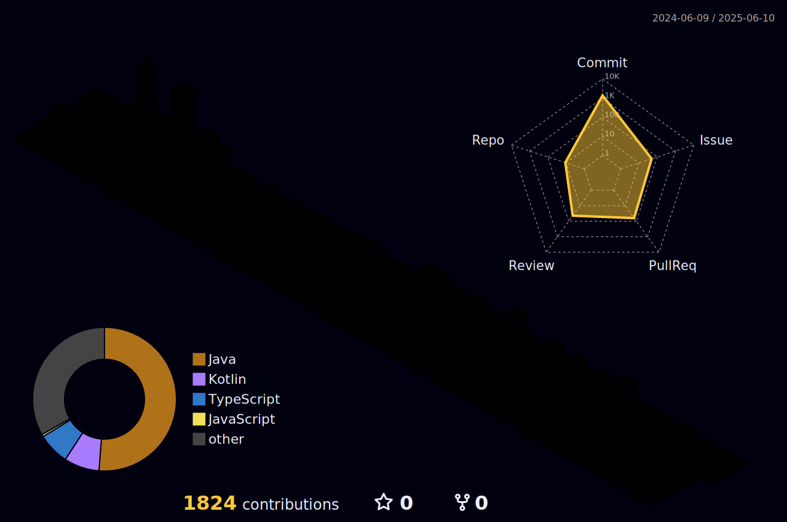

## ⌨️ Experience
<table>
  <thead>
    <tr>
      <th>기간</th>
      <th>경험</th>
      <th>비고</th>
    </tr>
  </thead>
  <tbody>
    <tr>
      <td>20-03-02 ~ 현재</td>
      <td>단국대학교 소프트웨어학과</td>
      <td>재학 중</td>
    </tr>
    <tr>
      <td>20-12-07 ~ 22-09-06</td>
      <td>공군 15특수임수비행단 정보보호병 821기</td>
      <td>병장 만기전역</td>
    </tr>
    <tr>
      <td>23-09-01 ~ 23-12-18</td>
      <td>티맥스티베로 캠퍼스SW아카데미사업(TABA) 4기</td>
      <td>우수교육생 선발</td>
    </tr>
    <tr>
      <td>24-01-02 ~ 24-02-26</td>
      <td>LG Aimers 4기</td>
      <td>수료</td>
    </tr>
  </tbody>
</table>

## 📚 Project
<table>
  <thead>
    <tr>
      <th>기간</th>
      <th>이름</th>
      <th>인원</th>
      <th>상태</th>
    </tr>
  </thead>
  <tbody>
    <tr>
      <td>23-09 ~ 23-12</td>
      <td><a href="https://github.com/TABA4-9">캠핑용품 대여 서비스</a></td>
      <td>5인</td>
      <td>완료</td>
    </tr>
    <tr>
      <td>24-03 ~ 24-06</td>
      <td><a href="https://github.com/DKU-CloudComputing">Imaginairy 웹 서비스</a></td>
      <td>1인</td>
      <td>완료</td>
    </tr>
    <tr>
      <td>24-03 ~ 현재</td>
      <td><a href="https://github.com/DKU-CapstoneDesign">외국인 유학생 커뮤니티 서비스</a></td>
      <td>5인</td>
      <td>진행 중</td>
    </tr>
    <tr>
      <td>24-06 ~ 현재</td>
      <td><a href="https://github.com/Alley-Oops-App">농구 커뮤니티 플랫폼</a></td>
      <td>5인</td>
      <td>진행 중</td>
    </tr>
  </tbody>
</table>

## 🔨 Tech Stack
<table>
  <thead>
    <tr>
      <th>Category</th>
      <th>Tools</th>
    </tr>
  </thead>
  <tbody>
    <tr>
      <th>Front-End</th>
      <td>
        

          
          
          
          
          
        

      </td>
    </tr>
    <tr>
      <th>Programming Languages</th>
      <td>
        

          
          
          
          
        

      </td>
    </tr>
    <tr>
      <th>Data Analysis / ML</th>
      <td>
        

          
          
          
          
        

      </td>
    </tr>
    <tr>
      <th>Database</th>
      <td>
        

          
          
          
          
          
        

      </td>
    </tr>
    <tr>
      <th>OS</th>
      <td>
        

          
          
          
        

      </td>
    </tr>
    <tr>
      <th>Back-End</th>
      <td>
        

          
          
          
          
          
          
        

      </td>
    </tr>
    <tr>
      <th>Public Cloud</th>
      <td>
        

          
          
          
          
        

      </td>
    </tr>
    <tr>
      <th>Containerization</th>
      <td>
        

          
          
        

      </td>
    </tr>
    <tr>
      <th>Git</th>
      <td>
        

           
           
        

      </td>
    </tr>
    <tr>
      <th>CI / CD</th>
      <td>
        

           
          
        

      </td>
    </tr>
    <tr>
      <th>Others</th>
      <td>
        

          
          
        

      </td>
    </tr>
  </tbody>
</table>

---
<table>
  <thead>
    <tr>
      <th>Category</th>
      <th>Details</th>
      <th>Views</th>
    </tr>
  </thead>
  <tbody>
    <tr>
      <td>🐙 Github</td>
      <td>
        

          
        

      </td>
      <td>
       

          
        

    </tr>
    <tr>
      <td>🐕 Blog</td>
      <td>
        

          
        

      </td>
      <td>
        
      </td>
    </tr>
    <tr>
      <td>📳 Contact</td>
      <td>
        

          
          
          
        

      </td>
      <td></td>
    </tr>
  </tbody>
</table>

---

